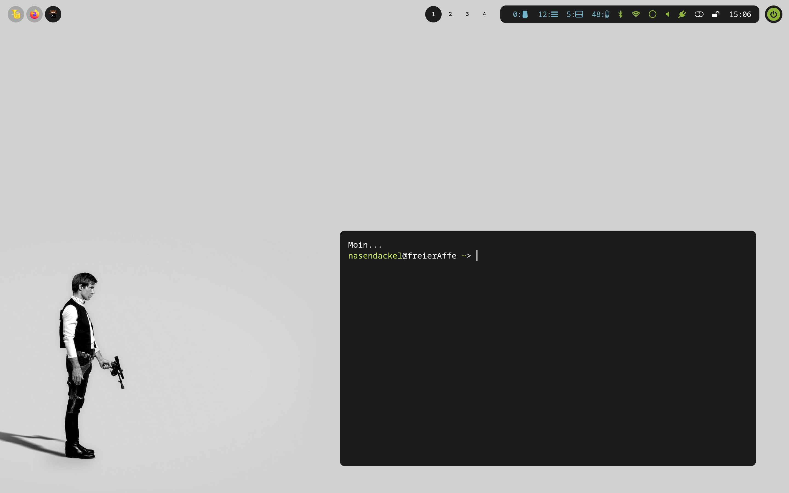

# Dotfiles for Fedora Linux (mainly Hyprland)

### Disclaimer:
Just a bunch of config files for my personal hyprland setup with Fedora Linux (currently 39). **Use at unkown risk!**
I got inspired by a lot of stuff from the internet:
- hyprland conf based on (https://gitlab.com/stephan-raabe)
- Colors based on (https://color.smyck.org/)
- Rofi Theme based on (https://github.com/lr-tech/rofi-themes-collection)
- Wallpaper Menu based on (https://github.com/AbdelrhmanNile)
- In case, that I forgot someone ... just say it :)

### Notes:
- This config is mainly for Fedora 39 running a on TUXEDO Pulse 14 Gen3 Version 1.0
- ~The screenmode is currently set to 2880x1800@120.00000hz.

### Screenshot:

### Have fun!
