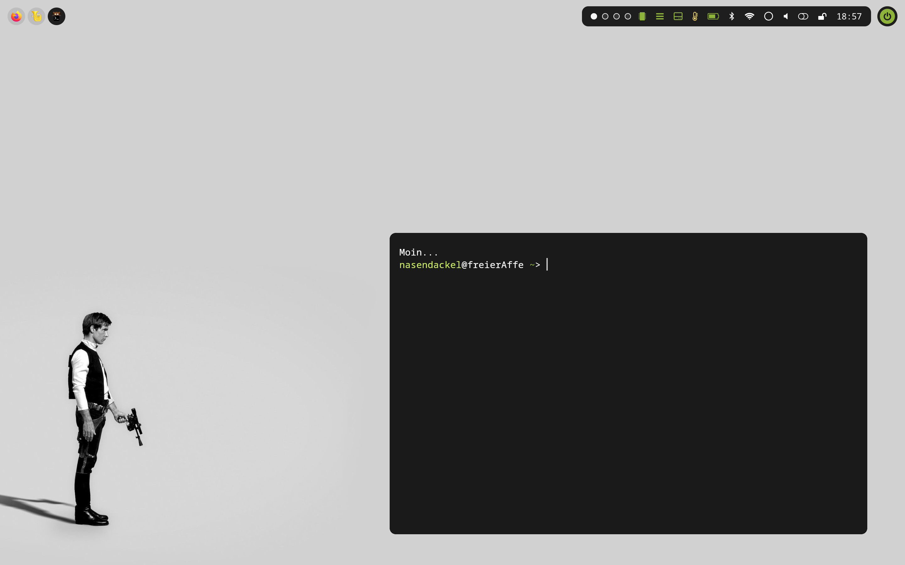
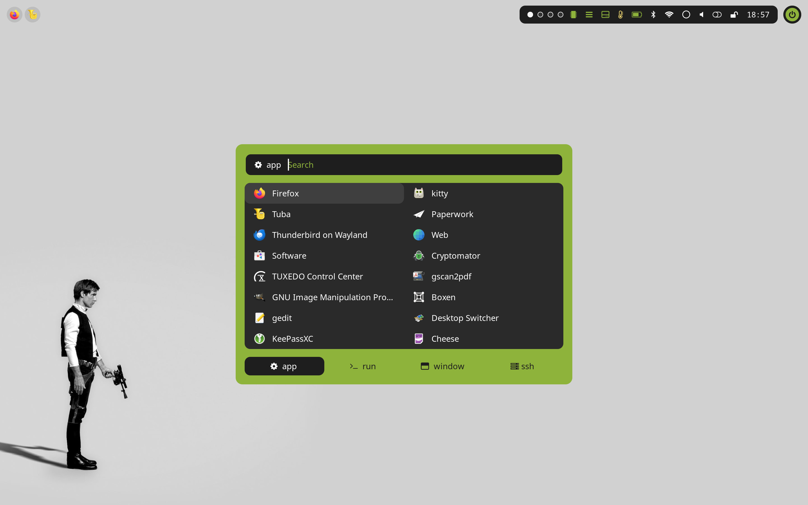

# Dotfiles for Fedora Linux (mainly Hyprland)

### Disclaimer:
Just a bunch of config files for my personal hyprland setup with Fedora Linux (currently 39). 

**Use at unkown risk!**

I got inspired by a lot of stuff from the internet:
- hyprland and wlogout conf based on (https://gitlab.com/stephan-raabe)
- colors based on (https://color.smyck.org/)
- rofi Theme based on (https://github.com/lr-tech/rofi-themes-collection)
- wallpaper Menu based on (https://github.com/AbdelrhmanNile)
- in case, that I forgot someone ... just say it :)

### Special Key-Bindings (just a few):
- SUPER + SHIFT + W : set wallpaper (looks a Images/Wallpaper)
- SUPER + SHIFT + R : scale display  (WARNING: Settings are specified for the TUXEDO Pulse 14 Gen3)
- SUPER + SHIFT + E : wlogout
- SUPER + RETURN: kitty
- SUPER + B: firefox
- SUPER + CTRL + B: firefox --private-window
- SUPER + T: tuba (Mastodon)
- SUPER + M: thunderbird Wayland
- SUPER + F: tautilus

### Notes:
- This config is mainly for Fedora 39 running a on TUXEDO Pulse 14 Gen3 Version 1.0
- The screenmode is currently set to 2880x1800@120.00000hz.

### Screenshots:

### Have fun!
